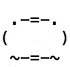

chicken-hatchling [](http://badge.fury.io/js/chicken-hatchling) [](https://travis-ci.org/hurrymaplelad/chicken-hatchling)
==============



```sh
$ npm install chicken-hatchling
```

From the command line:
```sh
$ chicken-hatchling
```

From node:
```js
var hatch = require('chicken-hatchling');

hatch(durationInMs, done);
```

Ascii sequence from http://www.retrojunkie.com/asciiart/animals/chickens.htm

Possibly the work of [JGS](http://www.ascii-art.com)

Chicken chicken: [chicken chicken chicken](http://torso.me/chicken)
